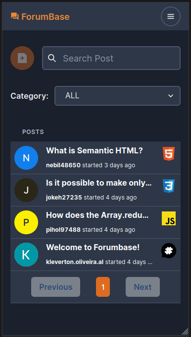
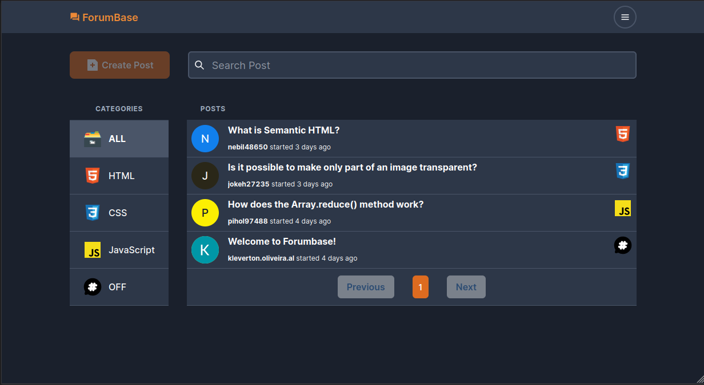

# :speech_balloon: ForumBase (English / Português)
[](https://github.com/KlevertonOliveira/forumbase/blob/main/LICENSE)

---

## :link: Links

[Live Project Site](https://forumbase-96f40.web.app/) /
[Site do Projeto ao vivo](https://forumbase-96f40.web.app/)

---

## :art: Layout
### Mobile


---

### Desktop


---

## :movie_camera: Project Demonstration / Demonstração do Projeto

https://user-images.githubusercontent.com/71989630/158437229-246bcc00-679a-47f4-89be-c7170d2f67dc.mp4

---

# English :uk:/:us:

## :mag_right: About the project

ForumBase is a project that I conceived and developed from scratch as a personal challenge in order to put my acquired knowledge into practice and learn new technologies during the process.

The project's idea is to provide the community of users with an online environment conducive to the exchange of ideas and knowledge between developers of all levels, using the Q&A format, with all interaction carried out through posts and answers, similar to the scheme used on the Stack Overflow website, from which this application took its inspiration.

Next.js (React Framework) was the most suitable choice for this application as it provides easy management of states and components, in addition to enabling easy integration with the other stacks used.

In addition, the application also made use of Chakra UI library for a faster, concise, accessible and customizable interface development experience, as it allows the creation of a great and adaptable design system.

Finally, the Firebase platform presented itself as the ideal tool for building the logical part of the project, being the structure responsible for the authentication flow, database interactions and hosting service for the application (and also being source of inspiration for the project's name!)

---

## :medal_military: Features
* Registration of new users through the Sign Up page;
* Log into the application using both email provider (after Sign Up) or Google Provider;
* Log Out;
* Creation of new posts/questions and answers (user must be logged in);
* Edit and delete posts and answers (available only for it's author);
* Post search based on title;
* Dark Mode (user can switch between light and dark mode in main menu); 

----

## :gear: Technologies Used

### Front end
- HTML5
- [Next JS](https://nextjs.org/) (React Framework)
- [Chakra UI](https://chakra-ui.com/) (React Library for creating User Interfaces and Design Systems)
- [Firebase](https://firebase.google.com/) (Google Platform for creating mobile and web applications)
- [TypeScript](https://www.typescriptlang.org/) (Superset of JavaScript)
- [Formik + Yup](https://formik.org/) (React Libraries for building and validating forms)

## :file_folder: How to run the project 

Prerequisites: npm / yarn

```bash
# Clone repository
git clone git@github.com:KlevertonOliveira/forumbase.git

# Enter the project folder
cd forumbase

# Install dependencies
yarn install 
or 
npm install

# Firebase Configuration steps necessary to run the project:

## Create a Firebase Project;
## Paste the Projects configuration data at the .env.local file, following the .env.example file model;
## Enable Authentication using both Email Provider and Google Provider;
## Inside the project, copy the content inside the database.rules.json file;
## Enable Realtime Database and go to the tab "Rules";
## Paste the content and save the changes made; 

# Run the project
yarn dev
or
npm run dev
```

## :raising_hand_man: Author

José Kleverton Yvens Oliveira

https://www.linkedin.com/in/klevertonoliveira/

---
---
---

# Português :brazil:

## :mag_right: Sobre o projeto

ForumBase é um projeto que idealizei e desenvolvi do zero como um desafio pessoal com o intuito de colocar em prática meus conhecimentos adquiridos e aprender novas tecnologias durante o processo.

A ideia do projeto é fornecer à comunidade de usuários um ambiente online propício à troca de ideias e conhecimentos entre desenvolvedores de todos os níveis utilizando o formato Q&A, sendo toda a interação realizada através de publicações e respostas, tal como ocorre no site Stack Overflow (de onde esta aplicação obteve sua inspiração).

O framework Next.js (React) foi a escolha mais indicada para essa aplicação por fornecer fácil gerenciamento de estados e componentes, além de possibilitar fácil integração com as demais stacks utilizadas.

Além disso, a aplicação fez uso também da biblioteca Chakra UI para uma experiência de desenvolvimento de interfaces mais rápida, concisa, acessível e customizável, por permitir a criação de um ótimo e adaptável design system.

Por fim, a plataforma Firebase se apresentou como a ferramenta ideal para construção da parte lógica do projeto, sendo a estrutura responsável pelo fluxo de autenticação, interações com o banco de dados e o serviço de hospedagem para a aplicação (além de servir como inspiração para o nome do projeto!).

---

## :medal_military: Features
* Registro de novos usuários através da página de Sign Up (cadastro);
* Log in (entrar como usuário) na aplicação utilizando provedor de e-mail (após o cadastro) ou através do provedor Google;
* Log out (sair);
* Criação de novas postagens/questões e respostas (usuário precisa estar logado);
* Edição e remoção de postagens e respostas (disponível apenas para o autor);
* Pesquisa de postagem baseada em título;
* Tema escuro (usuário pode alternar entre tema claro e tema escuro no menu principal); 

---

## :gear: Tecnologias utilizadas

### Front end
- HTML5
- [Next JS](https://nextjs.org/) (React Framework)
- [Chakra UI](https://chakra-ui.com/) (Biblioteca React para a criação de interafces de usuário e Design Systems)
- [Firebase](https://firebase.google.com/) (Plataforma Google para criação de aplicações mobile and web)
- [TypeScript](https://www.typescriptlang.org/) (Superset de JavaScript)
- [Formik + Yup](https://formik.org/) (Bibliotecas React para criação e validação de formulários)

---

Pré-requisitos: npm / yarn

```bash
# Clonar repositório
git clone git@github.com:KlevertonOliveira/forumbase.git

# Entrar na pasta do projeto
cd forumbase

# Instalar dependências
yarn install 
ou 
npm install

# Passos para configuração do Firebase necessários para execução do projeto:

## Crie um Projeto Firebase;
## Cole os dados de configuração do Projeto no arquivo .env.local, seguindo o modelo do arquivo .env.example;
## Habilite a Autenticação usando os provedores de Email e do Google;
## Dentro do projeto, copie o conteúdo dentro do arquivo database.rules.json;
## Habilite o Realtime Database e vá até a aba "Regras";
## Cole esse conteúdo e salve as alterações feitas;

# Executar o projeto
yarn dev
ou
npm run dev
```

## :raising_hand_man: Autor

José Kleverton Yvens Oliveira

https://www.linkedin.com/in/klevertonoliveira/

